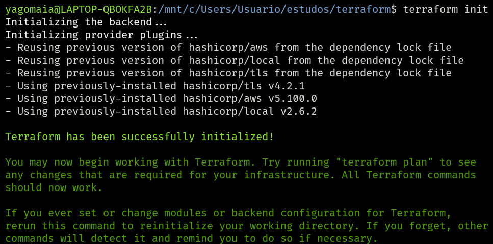
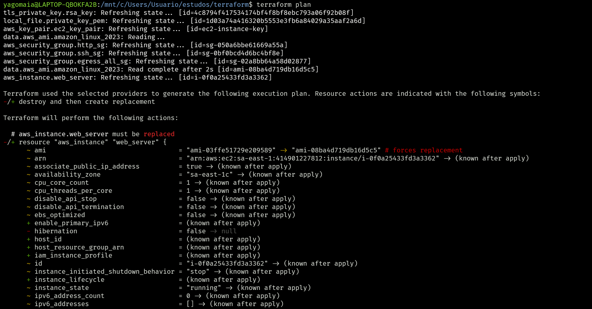
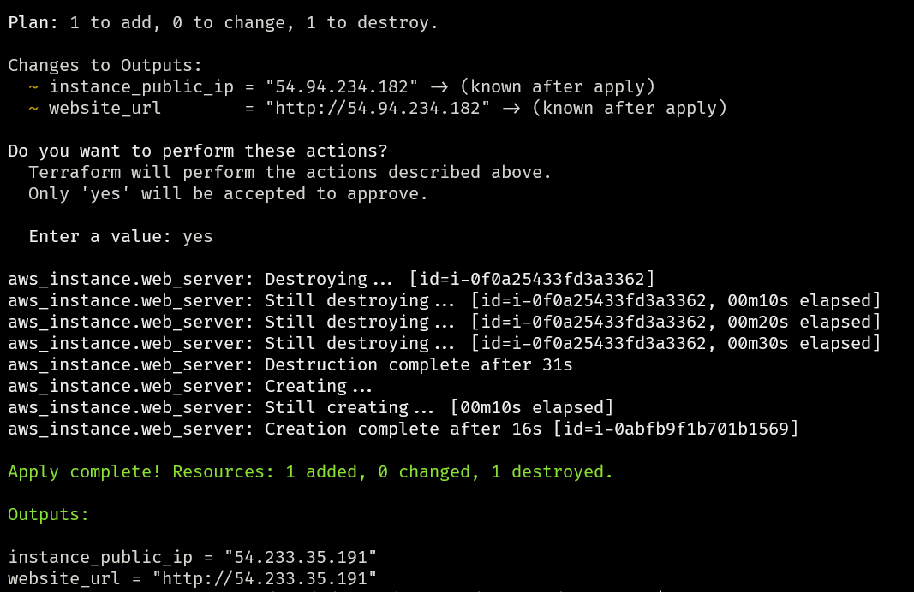
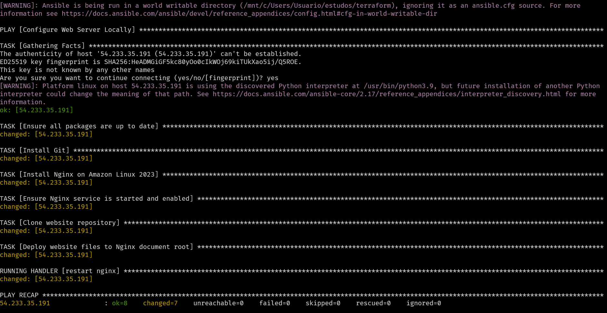

# Desafio Bootcamp DevOps AVANTI

Este repositório contém a solução do desafio prático do Bootcamp de DevOps da AVANTI.
O objetivo é demonstrar o provisionamento de infraestrutura na **AWS** utilizando **Terraform** e
fazer o **deploy de um site** com **Ansible**. Ao final você deverá obter uma página web
rodando em uma instância EC2, acessível via navegador (imagem ilustrativa abaixo).

---

## 🧩 Descrição do Desafio

1. Provisionar recursos na AWS com Terraform:
   - Security Group liberando portas 80 (HTTP) e 22 (SSH).
   - Criação de uma instância EC2.
   - Geração de par de chaves e arquivo `inventory` com IP público.

2. Configurar e deploy da aplicação com Ansible conectando na EC2 criada.

3. Entregar as evidências conforme instruções abaixo.

> O passo a passo oficial está disponível em:
> https://gitlab.com/avanti-dvp/iac-com-terraform-e-aws
>
> Se houver restrições de uso da AWS, utilize a versão alternativa para OCI:
> https://gitlab.com/avanti-dvp/iac-com-terraform-e-oci
>
> Você também pode realizar o desafio em outro provedor se preferir.

---

## 📁 Conteúdo do Repositório

- Arquivos `*.tf`: Terraform (ec2.tf, security_group.tf, key_pair.tf, variables.tf, etc.).
- `playbook.yml`: playbook do Ansible para instalar servidor web e deploy do site.
- `inventory`: inventário gerado com IP público da EC2.
- `ansible.cfg`: configurações do Ansible.

---

## 🔧 Como Executar

### Pré-requisitos

- Terraform instalado.
- Ansible instalado.
- Credenciais AWS configuradas localmente (`aws configure`).

### 1. Provisionar a infraestrutura (Terraform)

```bash
terraform init
terraform plan
terraform apply -auto-approve
```

Ao final será criado:

- um arquivo `.pem` (chave privada);
- o inventário `inventory` com o endereço público da EC2.

### 2. Ajustar permissões da chave (WSL/Windows)

Se estiver executando dentro de `/mnt/c/...`, mova e ajuste as permissões:

```bash
cp ec2-instance-key.pem ~/ec2-instance-key.pem
chmod 400 ~/ec2-instance-key.pem
```

Atualize o caminho da chave no arquivo `inventory` se necessário.

### 3. Configurar o servidor e deploy (Ansible)

```bash
ansible-playbook -i inventory playbook.yml
```

### 4. Acessar a aplicação

Abra o navegador em:

```
http://54.94.234.182
```

Você deve ver a página web provida pelo playbook.

---

## ✅ Evidências de Entrega

- Captura de tela do Terraform rodando (`terraform apply`).
- Captura de tela do Ansible rodando (`ansible-playbook`).
- Código fonte (Terraform + Ansible) em repositório Git ou ZIP.
- Captura de tela da página web em funcionamento.

### 📸 Capturas incluídas neste repositório

A pasta `images/` contém os prints que demonstram a execução dos comandos:

- **Terraform init**:
  
- **Terraform plan**:
  
- **Terraform apply**:
  
- **Ansible playbook**:
  
